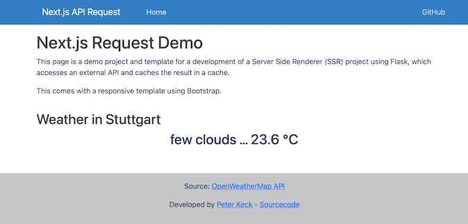

<h1 align="center">Welcome to Nextjs-api-request 👋</h1>
<p>
  
  <a href="https://github.com/pyrrolizin/flask-api-request/blob/master/LICENSE" target="_blank">
    
  </a>
</p>


This is a [Next.js](https://nextjs.org/) project bootstrapped with [`create-next-app`](https://github.com/vercel/next.js/tree/canary/packages/create-next-app).

>This project is a starting platform for a Next.js project that pulls data from an external API and caches the result. 
>The project includes a responsive Bootstrap 5 template.
>
>The Project uses yarn zero install (Plug'n'Play)

## 🏠 [Homepage](https://github.com/pyrrolizin/nextjs-api-request)

## ✨ Demo (OpenWeatherMap-Api - Current weather in Stuttgart, Germany)

tbd



## Prerequisit

* Node.js >= 16
* Yarn > 3

### Environment varaibles

You can set the following environment variables:

| NAME        |  *required*  |  Comment  |
| ----------- | ------------ | --------- |
| `API_KEY`   | **yes**      |  You can get your own free OpenWeatherApi key on this website: https://home.openweathermap.org/users/sign_up  |

You can either set the environment variables or use the `.env.local` file:
Make your own copy of the `.env.local` file and specify the `.env.local` and add the keys. 

```sh
cp ./.env.local_default ./.env.local
```

Learn more about the OpenWeatherMap API: https://openweathermap.org/api

## Getting Started

First, run the development server:

```bash
yarn dev
```

Open [http://localhost:3000](http://localhost:3000) with your browser to see the result.

## Deploy on Vercel

The easiest way to deploy your Next.js app is to use the [Vercel Platform](https://vercel.com/new?utm_medium=default-template&filter=next.js&utm_source=create-next-app&utm_campaign=create-next-app-readme) from the creators of Next.js.

Check out the [Next.js deployment documentation](https://nextjs.org/docs/deployment) for more details.
